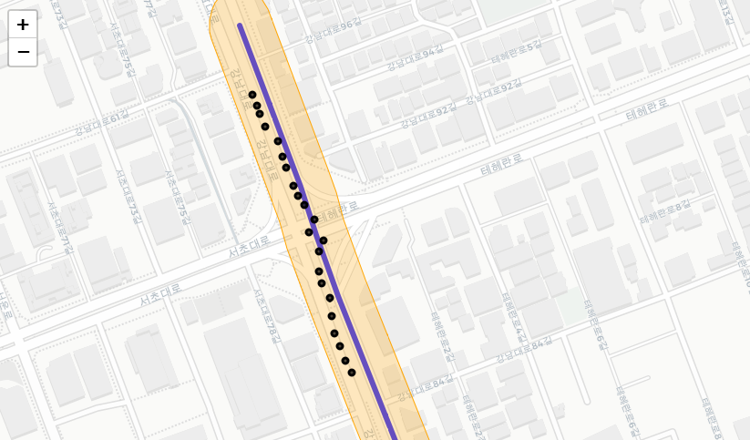
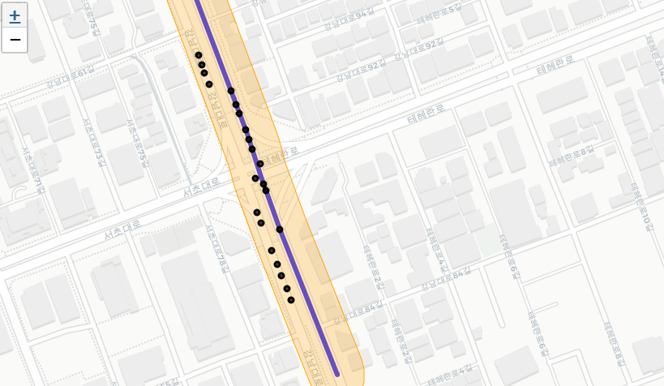
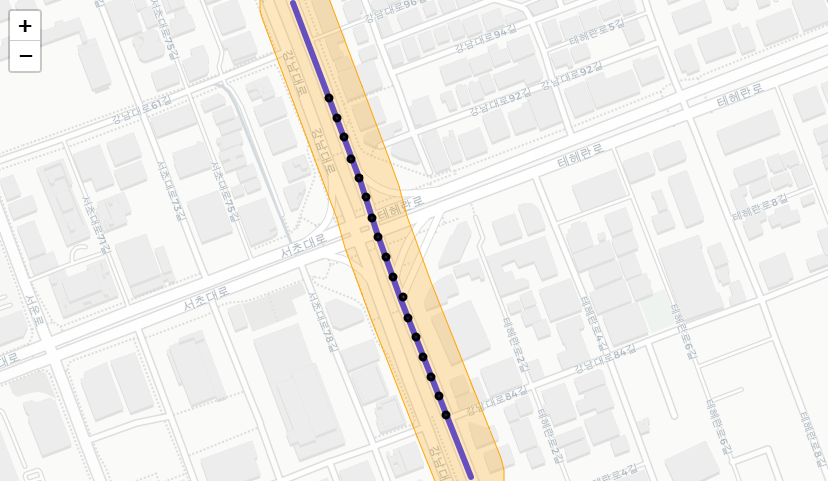
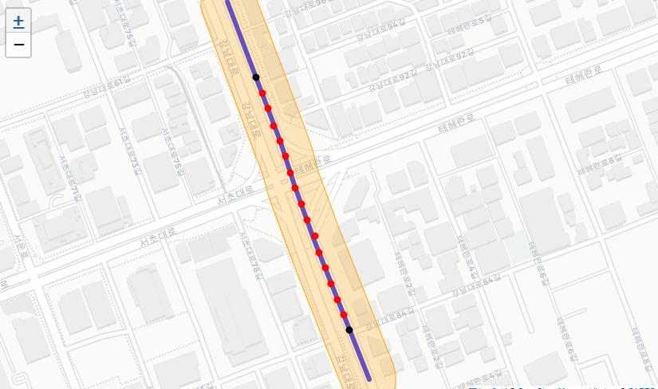
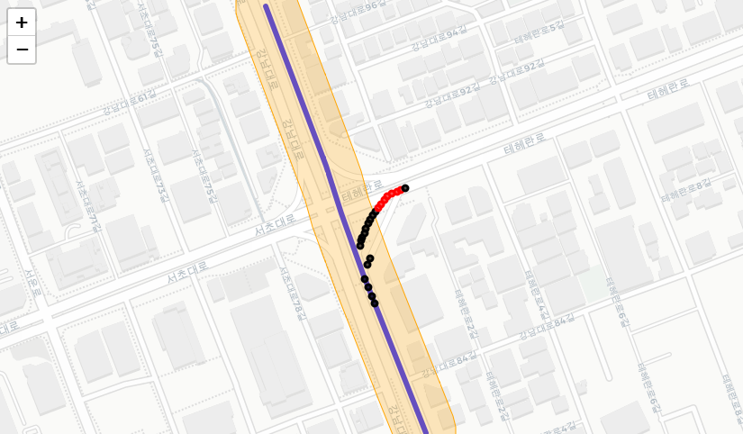
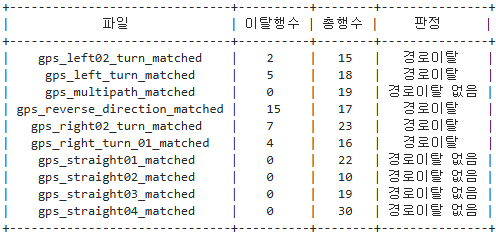

# 62743083-task-1 Map Matching&경로이탈

## 👨‍💻 지원자 정보
- 이름: 윤태섭
- 포지션: ICT 개발 지원
- 프로젝트 사용 기술: Python, Jupyter, Anaconda
<br>

## 💻프로젝트 실행 방법

### 1. 실행 환경
- Python 3.8 이상 환경 필요 (Anaconda 또는 python.org 설치 권장)
- 필수 패키지: pandas, shapely, folium, tabulate, xmltodict
- VS Code + Jupyter 확장 또는 jupyter notebook으로 실행 가능

### 2. 실행 방법
1. pip install -r requirements.txt 또는 상단 pip 셀 실행
2. jupyter notebook 또는 jupyter lab 실행 후 .ipynb 열기
3. gps_logs, osm 폴더와 데이터 파일 경로 맞추고 셀 순서대로 실행
<br>

## 📦 사용 라이브러리

| 목적          | 라이브러리                  | 비고                                                |
| ----------- | ---------------------- | ------------------------------------------------- |
| Jupyter 실행  | **Anaconda**             | 파이썬 환경 및 데스크탑 실행 관리 
| 인터페이스  | **Jupyter Notebook**             | 셀 기반 실험 및 시각화
| CSV·데이터 처리  | **pandas**             | `read_csv`, `apply`, 정렬·저장 등                      |
| OSM(XML) 파싱 | **xmltodict**          | 한 줄로 XML → 딕셔너리 변환                                |
| 지오메트리 엔진    | **shapely**            | `Point`, `LineString`, `nearest_points`, 거리·투영 계산 |
| 파일 순회       | **glob**, **pathlib.Path** | 여러 GPS CSV 일괄 처리                                  |

```bash
pip install pandas xmltodict shapely
```

<br>

## 🗺️ 데이터 구조

| 이름          | 형태                    | 설명                                           |
| ----------- | --------------------- | -------------------------------------------- |
| nodes     | 노드ID: (lon, lat)  | <node ..> 태그 모두를 딕셔너리로 저장                  |
| all_roads | {wayID: LineString} | <way> → 노드ID → 좌표 리스트 → LineString(노드≥2) |
| df      | DataFrame             | GPS CSV + 매칭 컬럼 포함                           |

<br>

## 🔑 핵심 함수

### 1) OSM 파싱 → **nodes**, **all_roads**

```python
# nodes
a = osm['osm']['node']
if isinstance(a, dict):
    a = [a]
nodes = {int(n['@id']): (float(n['@lon']), float(n['@lat'])) for n in a}

# ways
ways = osm['osm']['way']
if isinstance(ways, dict): ways = [ways]
all_roads = {}
for w in ways:
    coords = [nodes[nid] for nid in map(int, (nd['@ref'] for nd in w['nd'])) if nid in nodes]
    if len(coords) >= 2:
        all_roads[int(w['@id'])] = LineString(coords)
```

* 누락 노드가 있으면 자동으로 제외 → 길이만 조금 짧아짐.

### 2) GPS 한 점 → 가장 가까운 도로 찾기

```python
DEG2M = 111_320  # 위도 1° ≈ 111.32 km (서울 기준 근사)

def find_closest_road(lon, lat, roads):
    p = Point(lon, lat)  # (경도, 위도) 순서!
    best_way, best_d, best_proj = None, float('inf'), None
    for wid, line in roads.items():
        d = p.distance(line)  # 단위: 도(degree)
        if d < best_d:
            best_way, best_d = wid, d
            best_proj = nearest_points(p, line)[1]  # 수직 투영점
    return best_way, best_d * DEG2M, best_proj  # metres
```

### 3) match_row() – DataFrame apply용

```python
def match_row(row):
    wid, dist_m, proj = find_closest_road(row.Longitude, row.Latitude, all_roads)
    return pd.Series({
        'matched_way':  wid,
        'match_dist_m': dist_m,
        'proj_lat':     proj.y,  # 위도
        'proj_lon':     proj.x   # 경도
    })

df[['matched_way','match_dist_m','proj_lat','proj_lon']] = df.apply(match_row, axis=1)
df['matched_way'] = df['matched_way'].astype('Int64')
```

| 최종 컬럼                  | 의미            |
| ---------------------- | ------------- |
| `matched_way`          | 가장 가까운 도로(ID) |
| `match_dist_m`         | 도로까지 수직 거리(m) |
| `proj_lat`, `proj_lon` | 도로 위 투영 좌표    |

<br>

## 🧹 오차(노이즈) 필터

```python
df['noisy'] = (df['match_dist_m'] > 30) | (df['HDOP'] >= 3)
clean_df = df[~df['noisy']].reset_index(drop=True)
```

* **거리 30 m 초과** 또는 **HDOP ≥ 3** → `noisy=True`.


<br>

## 🔄 GPS CSV 일괄 처리

```python
for csv in glob('../gps_logs/gps_*.csv'):
    df = pd.read_csv(csv)
    df[['matched_way','match_dist_m','proj_lat','proj_lon']] = df.apply(match_row, axis=1)
    df.to_csv(csv.replace('.csv', '_matched.csv'), index=False)
```

* 기존 파일 이름 + `_matched.csv` 로 결과 저장.

<br>

## ✅ 맵매칭 결과 시각화

### Map Matching 적용 전


### Map Matching 적용 후



## 🚗 GPS 기반 경로 이탈 판정 시스템

본 프로젝트는 주어진 기준 경로(baseline)에 대해 GPS 로그 파일이 얼마나 잘 따라가는지를 분석하여 "경로이탈 여부"를 판정합니다.

<br>

## 1️⃣ 기준 경로 생성

```python
from shapely.ops import linemerge, unary_union

# 기준 경로를 구성하는 5개 way ID
route_set = {
    521766182, 990628459, 472042763, 218864485, 520307304
}

# 해당 way들의 LineString을 하나로 합치기
baseline = linemerge(unary_union([all_roads[w] for w in route_set]))

# ±40m 버퍼 생성 (도로 폭을 감안)
buf40_deg = baseline.buffer(40 / DEG2M)
```

<br>


## 2️⃣ 맵매칭 결과를 바탕으로 경로 이탈 판정

```python
# 두 각도의 최소 차이 계산 함수
def ang_diff(a, b):
    return abs((a - b + 180) % 360 - 180)

# 기준선 따라 투영점 기준 방위각 계산
def seg_bearing(line, proj, delta=1e-6):
    s = line.project(proj)
    p1 = line.interpolate(max(0, s - delta))
    p2 = line.interpolate(min(line.length, s + delta))
    dx = (p2.x - p1.x) * math.cos(math.radians((p1.y + p2.y)/2))
    dy = p2.y - p1.y
    return (math.degrees(math.atan2(dx, dy)) + 360) % 360

# 한 GPS row가 역주행인지 판정
def is_reverse_row(r, thr=45):
    p = Point(r.proj_lon, r.proj_lat)
    road_ang = seg_bearing(baseline, p)
    return ang_diff(r.Angle, road_ang) > (180 - thr)

# 전체 판정 함수
def off_path_buffer(r):
    p = Point(r.proj_lon, r.proj_lat)
    if not buf40_deg.contains(p):
        return True
    return is_reverse_row(r)
```

<br>

## 3️⃣ 전체 파일에 대해 이탈 판정 실행

```python
summary = []

for path in glob.glob("../gps_logs/*_matched.csv"):
    name = pathlib.Path(path).stem
    df = pd.read_csv(path)

    # 거리 + 방향 이탈 여부
    df["raw_off"] = df.apply(off_path_buffer, axis=1)

    # 3연속 이상 이탈 시 경로이탈로 판정
    df["off_path"] = df["raw_off"].rolling(3, center=True).sum() >= 3

    off_cnt = int(df["off_path"].sum())
    verdict = "경로이탈" if off_cnt else "경로이탈 없음"

    summary.append([name, off_cnt, len(df), verdict])

# 결과 출력
result = pd.DataFrame(summary, columns=["파일", "이탈행수", "총행수", "판정"])
```

<br>

## 4️⃣ 지도 시각화 (선택)

```python
# 기준 경로 및 GPS 위치 시각화
for _, row in df.iterrows():
    folium.CircleMarker(
        location=(row.Latitude, row.Longitude),  # 원본 GPS 위치
        radius=3,
        color="red" if row.off_path else "black",
        fill=True
    ).add_to(m)

# 지도 저장
m.save("gps_straight01_map.html")
```


## 📌 실행 방법 요약

1. `roads.osm` → 파싱해서 `all_roads` 생성
2. `*_matched.csv` → 맵매칭 완료된 CSV 불러오기
3. 위 함수들로 경로 이탈 여부 판정
4. 필요 시 `folium`으로 지도 시각화


## 🖼 이탈판정 비교 시각화 이미지
### 역주행 차량 각도 판정 전

### 역주행 차량 각도 판정 후

### 우회전 경로 버퍼 범위 벗어난 경우

### 판정 결과 테이블


### 📁 프로젝트 구조

```
📂 data/
    ├─ roads.osm 
📂 feedback/
    ├─ READ.ME  
📂 gps_logs/
    ├─ gps_straight01.csv         # 원본 GPS 로그
    ├─ gps_straight01_matched.csv # 맵매칭 후 결과 (위도/경도 → 투영점 좌표 포함)
    └─ ...
📂 imgs/
    ├─ ...
📂 notebooks/
    └─ map_matching.ipynb
```
